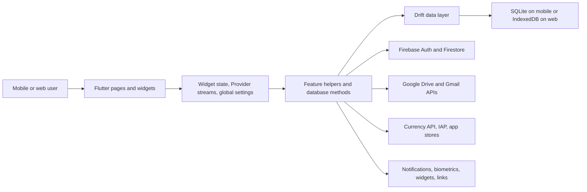
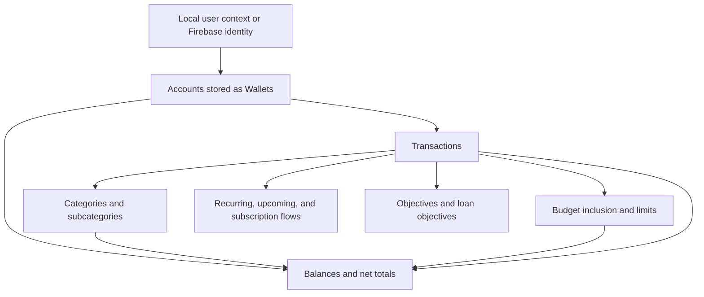

# Architecture

## System overview

Cashew is a Flutter monolith with a local-first Drift database and optional cloud/service integrations. The boundaries below describe the implementation as it exists, not an aspirational architecture.

## Layer map

| Concern | Current implementation | Main locations | Assessment |
|---|---|---|---|
| Presentation | Stateful pages, dialogs, reusable widgets, responsive shell | `lib/pages`, `lib/widgets`, `lib/settings` | Rich and reusable, but often owns business rules |
| Navigation | Nested Navigator, numeric indexed pages, `pushRoute` | `main.dart`, navigation widgets, `functions.dart` | Functional; globally coupled and hard to type-check |
| State | `setState`, Drift streams, StreamBuilder, limited Provider, globals | `main.dart`, pages/widgets, `appStateSettings` | Reactive but inconsistent |
| Business logic | Calculations and workflows embedded in UI/helpers/database | `pages`, `widgets`, `struct`, `database/tables.dart` | Proven logic, weak isolation |
| Data access | Drift tables, queries, companions, watch streams | `database/tables.dart` and generated code | Mature but concentrated in a very large file |
| Local persistence | Native SQLite and web Drift storage | `database/initialize_db_*` | Local-first and cross-platform |
| Cloud | Firebase Auth and Firestore sharing | Firebase helpers and shared-budget code | Optional but tied to original project |
| Backup/sync | Raw database backup plus per-client merge/tombstones | backup/sync helpers and Drift logs | Valuable, requires hardening and migration tests |
| Platform services | Local notifications, listener service, widgets, IAP, links, biometrics | platform projects and feature helpers | Broad capability, configuration-heavy |

## Runtime flow

`main.dart` is the composition root. It initializes Firebase, localization, preferences, the Drift database, notifications, currencies, and timezones before creating `MaterialApp`. The root builder installs biometric gating, notification handling, app links, day-change handling, and Provider streams for wallet state.

The home shell switches among principal pages with an indexed stack. Screens watch Drift queries and directly invoke database methods. Editing a transaction can update account balances, category relationships, budgets, goals, recurring metadata, attachments, and sync timestamps through code shared across the page, widgets, and database layer.

## State-management detail

The app does not use a single state-management architecture:

- Provider exposes `AllWallets` and `SelectedWalletPk` streams.
- Drift `watch` queries drive most financial views.
- Stateful widgets own temporary form and interaction state.
- `appStateSettings` is a dynamic global map persisted to SharedPreferences and mirrored into the database.
- Global keys coordinate navigation, page state, refreshes, and overlays.

For rebranding, visual components can be replaced around existing callbacks and query streams. For new financial modules, typed application services and immutable view models should be introduced feature by feature.

## Conceptual financial relationships

Cashew has no local `User` table. A person/device operates local wallets; Firebase identity is used only by cloud features. “Accounts” in the UI are stored as wallets, and “Goals” are stored as objectives.

## External-service boundaries

- Firebase Auth: Google credential sign-in and anonymous authentication for selected cloud paths.
- Firestore: shared budgets and their transaction subcollections.
- Google Drive: app-data backups/sync and optional visible-file attachment access.
- Gmail: optional read/modify access for email-scanning templates.
- Currency data: remote latest-rate JSON from a third-party public source.
- Stores: purchases/subscriptions, app review, and platform listing links.
- OS integrations: biometrics, scheduled local notifications, Android notification listener, quick actions, home widgets, file/image selection, and deep links.

All cloud/service adapters currently sit close to feature/UI code. Phase 1 should put environment-specific values behind a checked, non-secret configuration boundary before new branding work.

## Target separation direction

The safe evolution is not a clean-architecture rewrite. Introduce boundaries only around verified behavior:

1. Keep Drift and its migration chain as the persistence foundation.
2. Add typed repositories/services over existing queries for each feature being changed.
3. Move calculations into pure, tested functions before redesigning their screens.
4. Replace global navigation indexes gradually with named, typed destinations.
5. Give Firebase/Google/store integrations explicit interfaces and environment configuration.
6. Build a tokenized visual component layer above the retained financial behavior.

This produces the desired separation between financial logic and visual presentation without discarding mature workflows.
