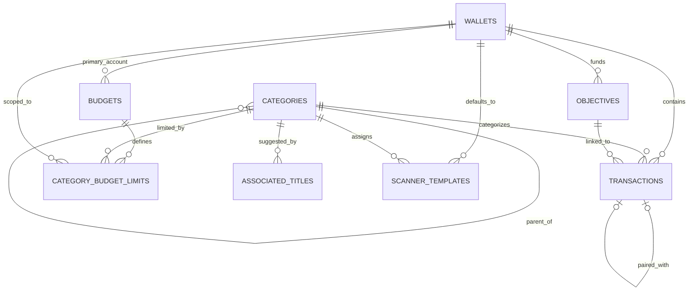

# Database Architecture and Safety

## Storage model

Cashew is local-first. Drift is the data-access layer over native SQLite on Android/iOS. Native storage uses a foreground reader/background writer executor and a database file named `db.sqlite` in the application's documents area. Web uses Drift web storage backed by IndexedDB, with legacy local-storage compatibility behavior.

The current schema version is **46**. The implementation and migrations are concentrated in `budget/lib/database/tables.dart`, with generated Drift code alongside it and exported schema snapshots under `budget/drift_schemas/` for versions 33–46.

## Tables

| Table / Dart row | Purpose | Important relationships |
|---|---|---|
| `Wallets` / `TransactionWallet` | Accounts, currency, balance/display configuration, archive/type data | Referenced by transactions, budgets, limits, scanner templates, objectives |
| `Transactions` | Income/expense, transfers, recurrence, due/paid state, notes, attachments, sharing, goal links | Wallet, category/subcategory, paired transaction, objectives; budget exclusions stored as a serialized list |
| `Categories` / `TransactionCategory` | Categories and nested subcategories | Optional self-reference to main category |
| `CategoryBudgetLimits` | Per-budget/category/account limit records | Category, budget, and wallet |
| `AssociatedTitles` / `TransactionAssociatedTitle` | Title-to-category suggestions/mapping | Category |
| `Budgets` | Periods, limits, inclusion/exclusion, archive/history, sharing metadata | Primary wallet plus serialized wallet/category/member lists |
| `AppSettings` | Settings mirrored into the database for backup/sync | Key/value-like application state |
| `ScannerTemplates` | Email/notification parsing templates | Category and wallet |
| `Objectives` | Savings goals and loan objectives | Wallet; referenced by transactions |
| `DeleteLogs` | Tombstones for device sync | Records deleted table/primary-key identity and timing |

## Relational map

Some logical many-to-many relationships are **not** normalized foreign-key relationships. Budget wallet/category inclusions and exclusions, shared members, and transaction budget exclusions are stored as serialized string lists. This reduces join complexity in the existing app but weakens referential integrity, queryability, and future server synchronization.

No local user/household table exists. Firebase identity and shared-budget membership are cloud concerns. Explicit enabling of SQLite foreign-key enforcement was not found during this audit, so enforcement must be verified with runtime tests rather than assumed.

## Migration history

The application has early manual migrations and Drift step-by-step migrations backed by exported schemas from version 33 onward. Significant transitions include:

| Versions | Change category |
|---|---|
| 33–35 | Wallet decimal behavior and budget-limit semantics |
| 35–37 | Transaction alteration and integer-to-string identifier conversion across tables |
| 37–39 | Original due dates and category emoji |
| 39–41 | Objectives/transaction links and category filter/exclusion data |
| 41–43 | Subcategories, home-widget data, and transaction budget exclusions |
| 43–45 | End dates, multi-wallet/income budget behavior, and wallet links |
| 45–46 | Paired transactions, objective loans, currency formatting, archive/type fields |

`beforeOpen` also performs repair/post-upgrade work for missing budget exclusions, widget display data, and wallet-setting keys. Several migration operations catch and print errors to tolerate imports from newer/different backup states. That resilience is practical, but swallowed failures can conceal partial migrations and must be covered by fixture tests.

## Backup and restore behavior

- Application settings are serialized into the database before backup.
- Native export copies the raw SQLite database; web export reads storage bytes.
- Google Drive backup writes version/device-named database files to appDataFolder.
- Device sync uses per-client database files, modification timestamps, and DeleteLogs tombstones.
- Restore downloads/reads bytes and replaces the live database, resets sync state for clients, and requires restart/refresh.

The inspected restore path does not establish a strong validation transaction before replacing the live file. Extension warnings are not a substitute for checking SQLite format, schema version, migration compatibility, integrity, available disk space, and checksum. Raw database backups are not encrypted by application code; the biometric option gates the UI but does not encrypt SQLite data at rest.

## Safe migration strategy for the new product

1. Preserve every historical migration and exported schema snapshot unchanged.
2. Establish golden database fixtures at representative versions, especially before/after identifier conversion and current v46.
3. Add automated forward-migration tests that open each fixture, run migrations, execute `PRAGMA integrity_check` and foreign-key checks, and verify row counts/financial totals.
4. Add semantic invariants: paired-transfer balance neutrality, valid category/account references, recurrence idempotency, currency/decimal preservation, and objective/budget totals.
5. Back up before migration and migrate through a temporary copy where platform storage permits; replace the live database only after validation.
6. Make each future migration deterministic, forward-only, resumable or safely retryable, and explicit about default/backfill values.
7. Never rewrite a released migration. Add a corrective migration with a new schema version.
8. Version backup metadata independently and reject newer unsupported backups without touching the current database.
9. Test web IndexedDB and native SQLite separately, including low-storage/interrupted cases.
10. Document rollback as restoring the pre-migration backup with the older compatible app—not by attempting destructive down-migrations.

## Priority risks

- No application migration test suite despite 46 schema versions.
- Raw restore can overwrite the active database before comprehensive validation.
- Serialized relationship lists make integrity enforcement and cloud evolution difficult.
- Timestamp-based multi-device merging is vulnerable to clock skew and conflict ambiguity.
- Broad try/catch migration behavior may hide partial or inconsistent upgrades.
- Financial data and raw backups lack application-level encryption.
- Large, centralized database code increases regression surface.

Schema changes should remain frozen until the fixture/migration harness exists and mobile backup/restore drills have passed.
