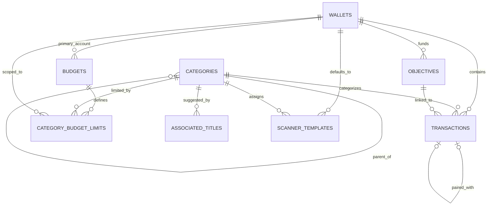

# Database Architecture and Safety

## Storage model

Cashew is local-first. Drift is the data-access layer over native SQLite on Android/iOS. Native storage uses a foreground reader/background writer executor and a database file named `db.sqlite` in the application's documents area. Web uses Drift web storage backed by IndexedDB, with legacy local-storage compatibility behavior.

The current schema version is **47**. The implementation and migrations are concentrated in `budget/lib/database/tables.dart`, with generated Drift code alongside it and exported schema snapshots under `budget/drift_schemas/` for versions 33–47.

## Tables

| Table / Dart row | Purpose | Important relationships |
|---|---|---|
| `Wallets` / `TransactionWallet` | Accounts, currency, balance/display configuration, archive/type data | Referenced by transactions, budgets, limits, scanner templates, objectives |
| `Transactions` | Income/expense, transfers, recurrence, due/paid state, notes, attachments, sharing, goal links | Wallet, category/subcategory, paired transaction, objectives; budget exclusions stored as a serialized list |
| `Categories` / `TransactionCategory` | Categories and nested subcategories | Optional self-reference to main category |
| `CategoryBudgetLimits` | Per-budget/category/account limit records | Category, budget, and wallet |
| `AssociatedTitles` / `TransactionAssociatedTitle` | Title-to-category suggestions/mapping | Category |
| `Budgets` | Periods, limits, inclusion/exclusion, archive/history, sharing metadata | Primary wallet plus serialized wallet/category/member lists |
| `AppSettings` | Settings mirrored into the database for backup/sync | Key/value-like application state |
| `ScannerTemplates` | Email/notification parsing templates | Category and wallet |
| `Objectives` | Savings goals and loan objectives | Wallet; referenced by transactions |
| `DeleteLogs` | Tombstones for device sync | Records deleted table/primary-key identity and timing |

## Relational map

Some logical many-to-many relationships are **not** normalized foreign-key relationships. Budget wallet/category inclusions and exclusions, shared members, and transaction budget exclusions are stored as serialized string lists. This reduces join complexity in the existing app but weakens referential integrity, queryability, and future server synchronization.

No local user/household table exists. Firebase identity and shared-budget membership are cloud concerns. SQLite foreign-key enforcement remains disabled. Phase 0C added a read-only direct-and-serialized relationship audit and applies it to restore candidates, but ordinary live databases are not automatically mutated or rejected.

## Migration history

The application has early manual migrations and Drift step-by-step migrations backed by exported schemas from version 33 onward. Significant transitions include:

| Versions | Change category |
|---|---|
| 33–35 | Wallet decimal behavior and budget-limit semantics |
| 35–37 | Transaction alteration and integer-to-string identifier conversion across tables |
| 37–39 | Original due dates and category emoji |
| 39–41 | Objectives/transaction links and category filter/exclusion data |
| 41–43 | Subcategories, home-widget data, and transaction budget exclusions |
| 43–45 | End dates, multi-wallet/income budget behavior, and wallet links |
| 45–46 | Paired transactions, objective loans, currency formatting, archive/type fields |
| 46–47 | Forward-only canonical rebuild for historical convergence and deterministic timestamp defaults |

`beforeOpen` also performs repair/post-upgrade work for missing budget exclusions, widget display data, and wallet-setting keys. Several historical migration operations catch and print errors. Phase 0C proved that those catches could leave non-canonical physical schemas, so v47 performs a final fail-closed canonical rebuild. Global-dependent legacy `beforeOpen` updates are skipped for upgrades reaching v47. The old callbacks were preserved rather than rewritten.

Data-rich tests now migrate representative v33, v36, v39, v41, v45, and v46 databases to v47 and compare the result with the exported current schema. They protect exact amounts, financial sums, wallet/category/budget/objective relationships, recurrence, transfer pairs, archives, and tombstones.

## Backup and restore behavior

- Application settings are serialized into the database before backup.
- Native export copies the raw SQLite database; web export reads storage bytes.
- Google Drive backup writes version/device-named database files to appDataFolder.
- Device sync uses per-client database files, modification timestamps, and DeleteLogs tombstones.
- Restore downloads/reads bytes, validates and migrates a temporary copy, activates only a validated current-schema database, resets sync state only after success, and requires restart/refresh.

Native restore checks the SQLite header, openability, supported schema range (v33–v47), required tables/current critical columns, `integrity_check`, declared foreign-key results, the full logical relationship audit, and transfer reciprocity. It retains a pre-restore safety copy, stages on the live filesystem, verifies the activated file, and restores a rollback file after activation/post-check failure. The two-rename swap is recoverable but is not claimed to be transactionally atomic.

Web restore validates/migrates in isolated memory, snapshots the previous IndexedDB/local-storage bytes, stores only the migrated current bytes, reads them back, and rolls back on store/post-check failure. Browser-process crash atomicity remains unproven. Raw database backups are not encrypted or checksummed by application code; the biometric option gates the UI but does not encrypt SQLite data at rest.

## Safe migration strategy for the new product

1. Preserve every historical migration and exported schema snapshot unchanged; v47 is the established forward-only repair pattern.
2. Keep the committed v33/v36/v39/v41/v45/v46 fixtures immutable and add a source-version fixture whenever a future schema boundary changes financial meaning.
3. Require schema equality, SQLite integrity, reference auditing, row/identifier preservation, and financial totals for every future migration.
4. Keep semantic invariants for paired-transfer neutrality, recurrence, currency/decimal preservation, and objective/budget totals.
5. Migrate restore candidates through temporary storage and retain the live safety copy until post-activation verification succeeds.
6. Make each future migration deterministic, forward-only, safely retryable where possible, and explicit about default/backfill values.
7. Never rewrite a released migration. Add a corrective migration with a new schema version.
8. Add a versioned, encrypted, checksummed backup envelope while retaining explicit compatibility policy for existing raw backups.
9. Add native-device and browser integration failure injection for low storage, process interruption, storage failure, and recovery.
10. Treat rollback as restoring retained bytes/files, never as a destructive schema down-migration.

## Priority risks

- Serialized relationship lists make integrity enforcement and cloud evolution difficult.
- Timestamp-based multi-device merging is vulnerable to clock skew and conflict ambiguity.
- Historical broad try/catch callbacks still log intermediate failures; v47 canonicalizes tested paths, but additional real-world fixture sampling is warranted.
- Financial data and raw backups lack application-level encryption.
- Large, centralized database code increases regression surface.
- Android/iOS filesystem, lifecycle, restart, low-storage, and restore behavior remains unverified on devices.
- Web recovery is not atomic across browser/process crashes and lacks browser failure-injection tests.

The migration/restore harness now exists and is green. Future schema work must extend it. Mobile backup/restore drills, foreign-key cleanup policy, encrypted/checksummed backup packaging, and security/privacy review remain mandatory before production release.
